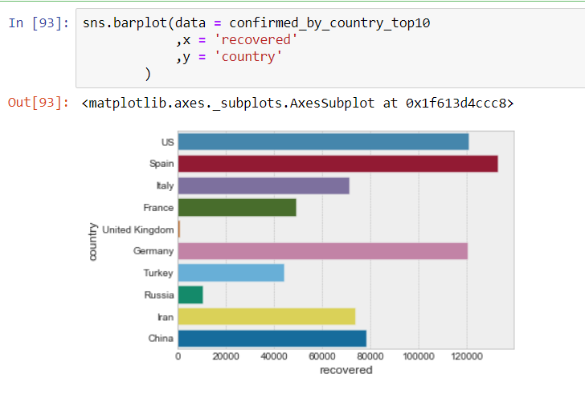
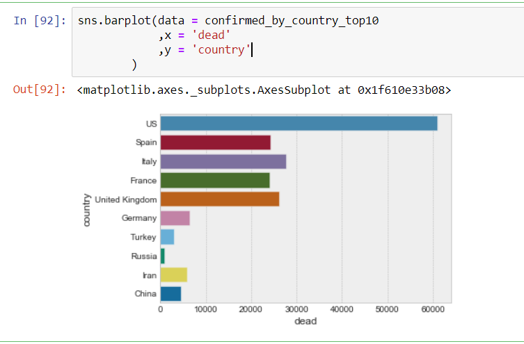
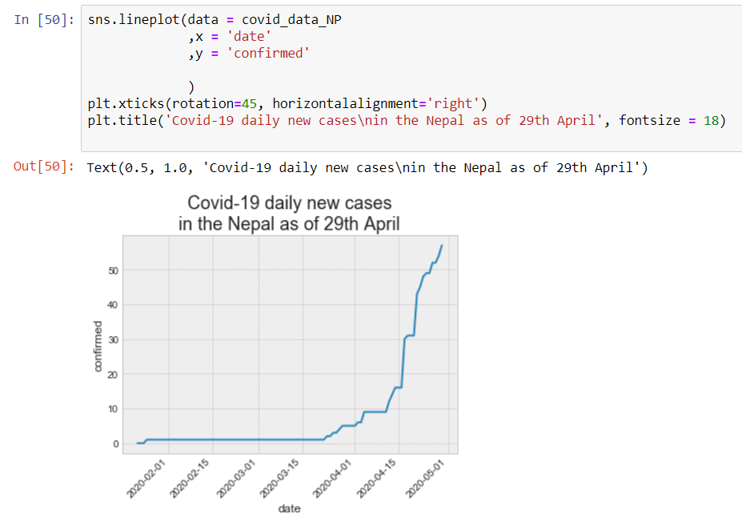

# COVID-Data-Visualisation
Trying to visulaize COVID data

Data from : https://github.com/CSSEGISandData/COVID-19/tree/master/csse_covid_19_data/csse_covid_19_time_series
Learning from: https://www.sharpsightlabs.com/
Visualisation using Seaborn

1. Get latest data from https://github.com/CSSEGISandData/COVID-19/tree/master/csse_covid_19_data/csse_covid_19_time_series
2. Combining global confirmed, recovered and death cases into one dataframe
3. Analyze !!!

## Some Reports

### 1. Total Cases as of 29th April

### 2. Top 10 countries confirmed cases as of 29th April

### 3. 10 countries recovered cases as of 29th April

### 4. 10 countries death cases as of 29th April

### 5. Nepal confirmed cases as of 29th April

